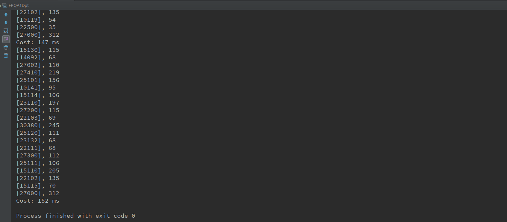
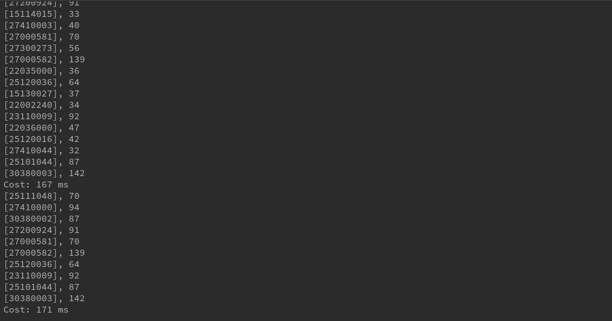
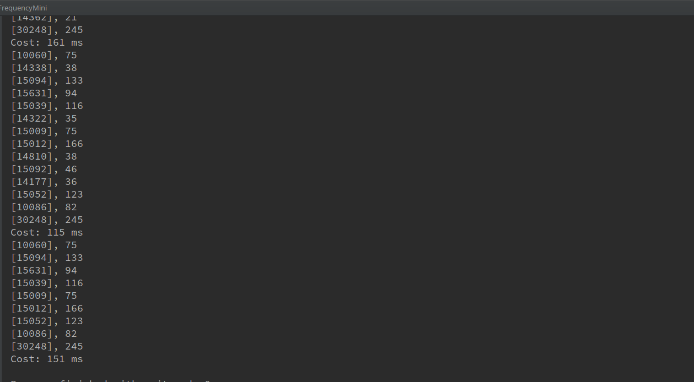
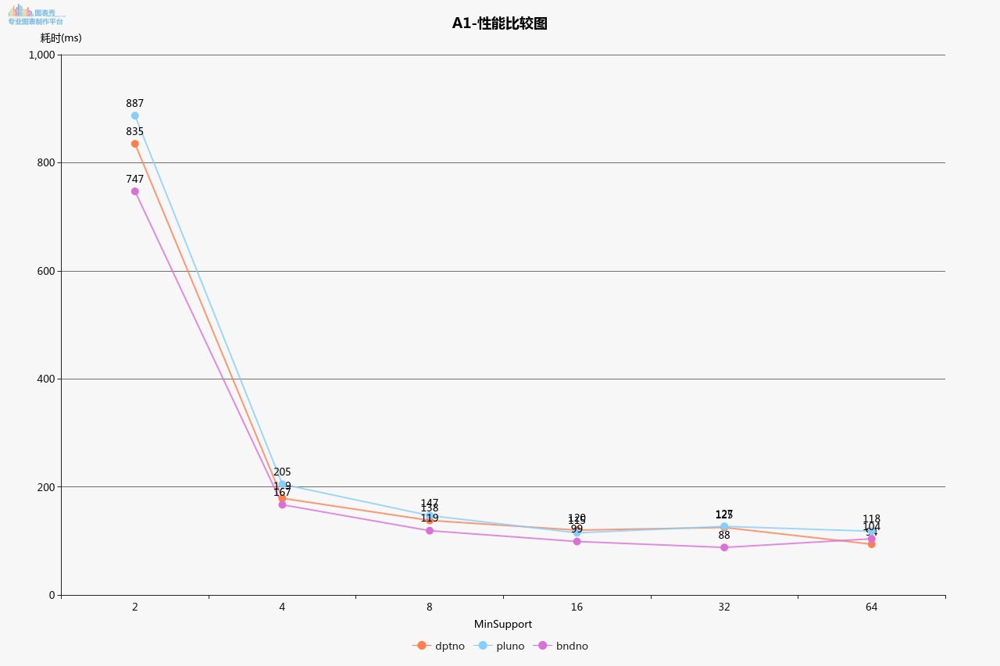

# Report

### 运行结果(数据行数太多，只截取最后一部分结果)

- dptno

  

- pluno

  

- bndno

  

#### 性能比较图

  	

#### 讨论分析

- FP-Growth 第一次扫描所有记录，构建项头表。然后再次扫描构建FP-TREE，再通过FP-TREE进行频繁集挖掘，性能上比Apriori 要好很多。
- 从性能图中可以看出，MinSupport 越大程序耗时越小，这与FP—Growth算法有关，MinSupport 越小，需要计算的项越多，到时计算的项比MinSupport大的更多，所以时间上会更慢，当MinSupport > 32 已经有很多项被过滤，所以构建FP-TREE相对简单了很多，自然时间消耗较小。
- 由于数据集太小，大部分时间消耗在数据预处理环节上，MapReduce环节上，无法发挥Spark分布式计算的优势。
- 由于未进行同一个vip的交易记录合并，每个记录都是单一的，因此结果中不存在两项及以上的频繁项集。

#### 作业说明
- 本作业使用python3对数据进行预处理，得到处理好的交易记录，再使用Spark MLLib进行频繁项集挖掘，因此作业中会有py文件以及scala文件，分别为数据处理程序和计算频繁项集程序。
- FPQA1Bnd.scala 为 item 为 bndno 的频繁集计算程序，类似FPQA1Dpt.scala 为 item为 dptno 的频繁集计算程序，FP_PreProcess.py 为数据预处理程序
- data 目录为中间结果文件