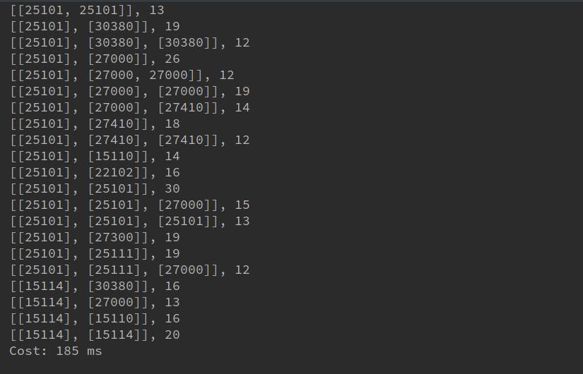
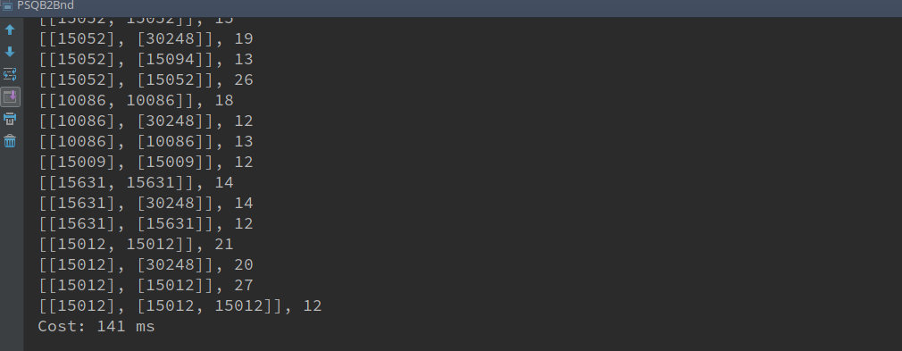
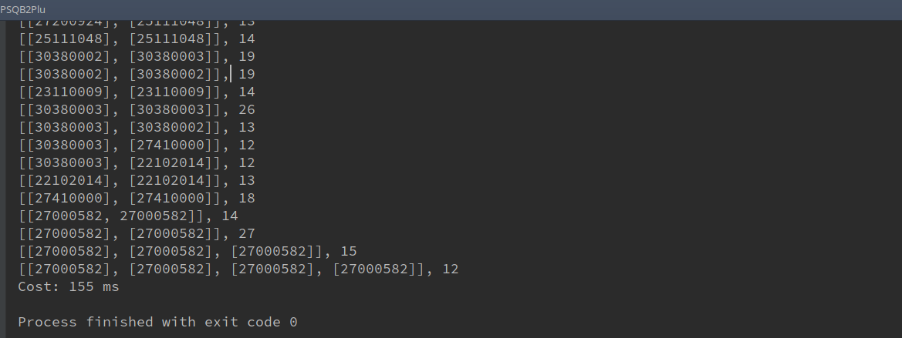
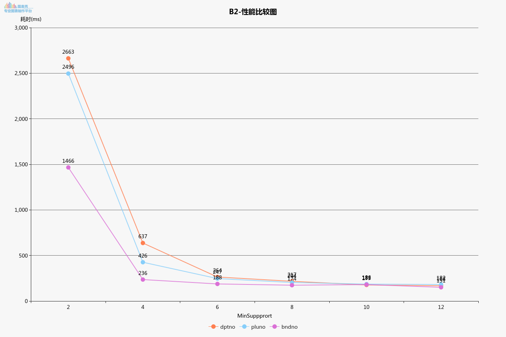

# Report

### 运行结果(数据行数太多，只截取最后一部分结果)

- dptno

  

- pluno

  

- bndno

  

#### 性能比较图

  	

#### 讨论分析

- 试验中，使用 **PrefixSpan** 算法进行频繁集数据挖掘，使用 Spark MLLib PrefixSpan 提供的 Api 进行计算

- Sequence 设计：

  将每个 vip 用户的记录合并，再把同一时间的几率合并，合并后的记录样本为：[[[121223,12312]],[12123]] 为一条记录。

- 从性能图中可以看出，MinSupport  越大程序耗时越小，这与  PrefixSpan 算法有关，MinSupport  越小，需要计算的项越多，到时计算的项比 MinSupport 大的更多，所以时间上会更慢，当 MinSupport > 32 已经有很多项被过滤，所以构建 PrefixSpan 后缀相对简单了很多，自然时间消耗较小。

- 由于数据集太小，大部分时间消耗在数据预处理环节上，MapReduce环节上，无法发挥Spark分布式计算的优势。

#### 作业说明
- 本作业使用python3对数据进行预处理，得到处理好的交易记录，再使用Spark MLLib进行频繁项集挖掘，因此作业中会有 **py** 文件以及 **scala**文件，分别为数据处理程序和计算频繁项集程序。
- FPSQB2Bnd.scala 为 item 为 bndno 的频繁集计算程序，类似FPSQB2Dpt.scala 为 item为 dptno 的频繁集计算程序，FP_PreProcess.py 为数据预处理程序
- data 目录为中间结果文件