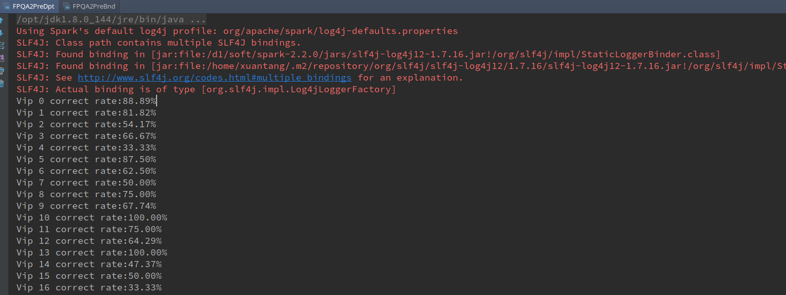
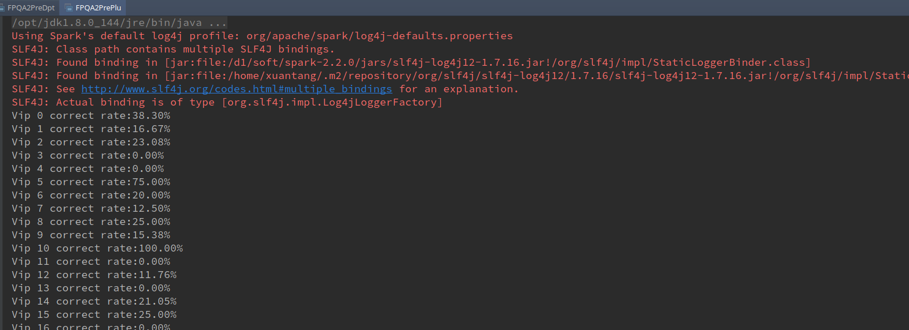
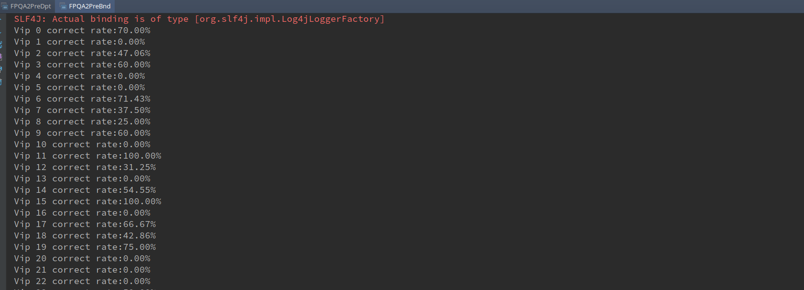
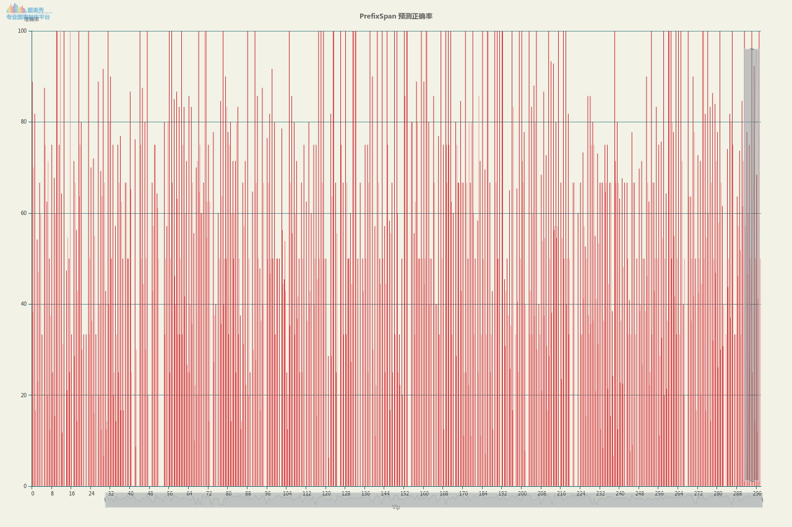

# FP-Growth Correction Rate  Report

### 运行结果(数据行数太多，只截取最后一部分结果)

- dptno

  

- pluno

  

- bndno

  

#### 预测结果可视化（分别是每个vip的三个特征上的准确率）

-  准确率图表	

#### 讨论分析

- 预测模型说明

  - 首先，训练数据集使用的是根据时间排序的前60%的数据，测试数据是后40%的数据，该数据是有Python语言进行提取，再使用 **scala **进行分析预测。

  - 本次实验使用 FP-Growth 挖掘的频繁集进行预测，使用 MinSupport = 4 的频繁项集，对每一个 vip 的训练集进行遍历，如果训练集的记录在频繁项集中出现，那么则预测该频繁项集的记录为此 vip 的购买记录，检查该记录是否存在于测试数据集，若存在则说明预测结果正确，若不存在，则预测失败。

  - 记用户v，找出为用户预测的记录与测试数据集相同的记录，记为 s, 测试记录数记为 t, 则该用户的准确率

    **r = s / t**

- 结果分析

  - 由上图可见，大部分预测结果比较高，将近50%，预测的准确率还不错。
  - 由于是  FP-Growth 无时间序列的挖掘，预测的结果要比基于时间序列的结果要好，原因在于无序频繁集的结果数要比有序频繁集的结果数要多。

- 性能分析

  - 使用 scala 进行分析，运行时间在 5s 左右，主要耗时于多层循环。

#### 作业说明
- 本作业使用python3对数据进行预处理，得到处理好的交易记录，再使用Spark MLLib进行频繁项集挖掘，因此作业中会有 **py** 文件以及 **scala**文件，分别为数据处理程序和计算频繁项集程序。另外，再做预测模型的时候，会多出两个文件，一个是训练数据，另一个是测试数据
- FPQA2PreBnd.scala 为 item 为 bndno 的预测，类似FPQA2PreDpt.scala 为 item为 dptno 的预测程序，FP_PreProcess.py 为数据预处理程序
- data 目录为中间结果文件